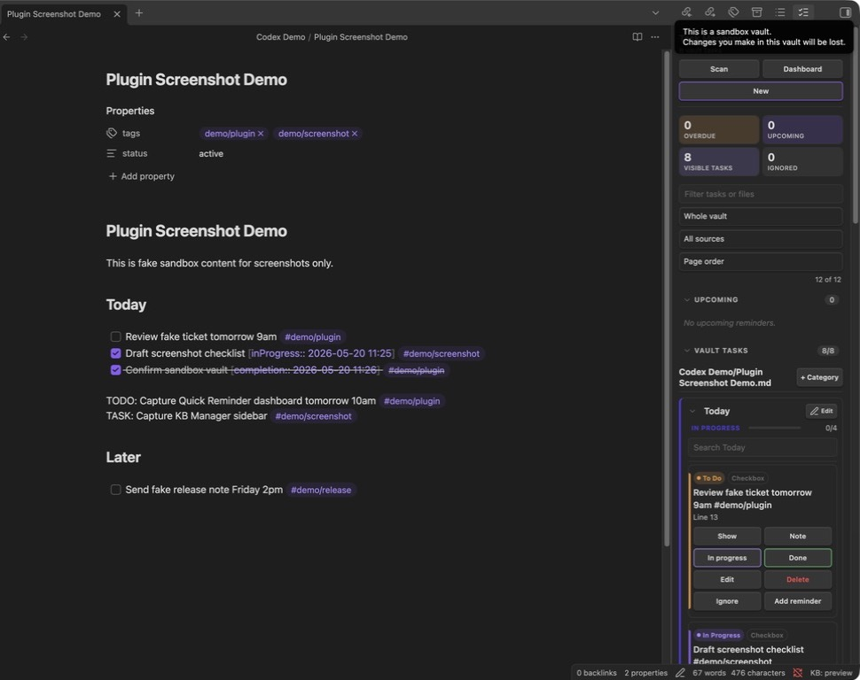

# Quick Reminder

Natural-language reminders for Obsidian, with desktop notifications where available and in-app notices on mobile. Type `call mom tomorrow 3pm`, get notified. Also includes a lightweight Markdown task dashboard for working with `- [ ]` task lines and `TODO:` / `FIXME:` / `TASK:` markers in your notes.

This plugin is not a replacement for the Tasks plugin. It focuses on natural-language reminders, local reminder notices, and a fast way to see and update existing Markdown tasks. If the Tasks plugin is installed, Quick Reminder will optionally call its task editor when you create a task reminder from the editor.

## What it does

- **Global hotkey -> tiny modal** -> type `call mom tomorrow 3pm` -> saved + scheduled.
- **Local reminder notices** - desktop notifications when the Web Notification API is available, and Obsidian in-app notices on iPad, iPhone, Android, or unsupported notification environments.
- **Chrono-node NLP parser** - handles `tomorrow`, `next tuesday at 10am`, `in 2 hours`, `friday morning`, etc.
- **Markdown mirror** - keeps a `Reminders.md` file in your vault synced with pending + notified reminders.
- **Launch-time catch-up** - fires any reminders that went overdue while Obsidian was closed.
- **Reminder manager** - done, snooze, edit, restore, re-add, and delete from one sidebar.
- **Vault task dashboard** - scans notes for unchecked Markdown tasks plus `TODO:`, `FIXME:`, and `TASK:` markers.

## Install

### Recommended: install with BRAT

For beta installs from GitHub, use [BRAT](https://github.com/TfTHacker/obsidian42-brat).

1. In Obsidian, install and enable **BRAT** from Community plugins.
2. Run **BRAT: Add a beta plugin for testing** from the command palette.
3. Enter:
   ```text
   https://github.com/schylerchase/quick-reminder
   ```
4. Enable **Quick Reminder** in **Settings -> Community plugins**.

BRAT will install the latest GitHub release into the current vault and can check for updates later.

### Installer zip

1. Download `quick-reminder.zip` from the latest GitHub release.
2. Unzip it.
3. Run the installer:
   - macOS: double-click `install-macos.command`.
   - Windows: right-click `install-windows.ps1` and choose **Run with PowerShell**.
4. Select your Obsidian vault folder.
5. In Obsidian, go to **Settings -> Community plugins** and enable **Quick Reminder**.

### Manual install

Copy these release assets into your vault:

```bash
mkdir -p /path/to/your/vault/.obsidian/plugins/quick-reminder
cp main.js manifest.json styles.css /path/to/your/vault/.obsidian/plugins/quick-reminder/
```

### Updates

If installed with BRAT, use **BRAT: Check for updates to beta plugins and UPDATE**. BRAT can also check beta plugins at Obsidian startup.

If installed manually, replace `main.js`, `manifest.json`, and `styles.css` in the plugin folder, then reload the plugin from **Settings -> Community plugins**.

## Usage

### New install: start with a template dashboard

Run **Quick Reminder: Start with template dashboard** or open **Settings -> Quick Reminder -> Starter dashboard -> Create/open starter board**. Quick Reminder creates a replaceable `Quick Reminder Dashboard.md` board with configured headings, sample tasks, and a managed mirror block. Existing starter-board files are opened, not overwritten.

For full docs, see the in-repo wiki pages in [`docs/wiki/Home.md`](docs/wiki/Home.md).

| Action | Command |
|---|---|
| Open reminder manager sidebar | Click the ribbon checklist icon, or command palette -> "Open reminder manager" |
| Open task dashboard | Command palette -> "Open task dashboard", or click **Dashboard** in the sidebar manager |
| Open capture modal | Command palette -> "Quick capture reminder" |
| Create task or task-backed reminder | Manager -> New |
| View/snooze/edit/done reminders | Reminder manager |
| Scan vault tasks | Reminder manager -> Scan |
| Insert task sections | Command palette -> "Insert task sections" |
| Create/open starter board | Command palette -> "Start with template dashboard" |
| Change snooze default, mirror file, etc. | Settings -> Quick Reminder |

## How to use Quick Reminder

Quick Reminder is easiest to understand as a right-sidebar task cockpit for the note you are already working in.



Screenshot annotations:

1. **Scan** refreshes the task list from your vault. Use it after large edits or if a task does not appear.
2. **Dashboard** opens the same task manager as a main workspace tab when you want more room.
3. **New** creates either a plain Markdown task or a task-backed reminder.
4. **Summary counters** show overdue reminders, upcoming reminders, visible tasks, and ignored tasks.
5. **Filters** narrow the list by text, scope, source type, and sort order.
6. **Vault Tasks** groups tasks by note, then by heading/status so you can work from the sidebar without moving lines around in the note.
7. **Task cards** expose the common actions: show the source line, add notes, move status, edit, delete, ignore, or add a reminder.
8. **Add reminder** appears when Quick Reminder detects a future time in the task text, such as `tomorrow 9am` or `Friday 2pm`.

### Common workflow: capture a reminder quickly

1. Press your Quick Reminder hotkey or run **Quick Reminder: Quick capture reminder**.
2. Type a natural-language reminder:
   ```text
   renew client certificate tomorrow 9am
   ```
3. Save it. Quick Reminder stores the reminder, schedules it locally, and mirrors it to the configured reminder note when Markdown mirroring is enabled.

Use this for fast, standalone reminders that do not need to live beside a source task.

### Common workflow: work tasks from the sidebar

1. Open a Markdown note that contains tasks.
2. Click the Quick Reminder ribbon icon or run **Quick Reminder: Open reminder manager**.
3. Click **Scan** if the task list has not refreshed yet.
4. Use **In progress**, **Done**, or **To do** directly on each task card.
5. Use **Show** when you want to jump back to the exact note line.

Quick Reminder updates the original Markdown task line. It does not create a separate task database.

### Common workflow: turn a task into a reminder

1. Write a normal task with a future time:
   ```md
   - [ ] follow up on the backup report tomorrow 10am
   ```
2. Open the manager and find the task card.
3. Click **Add reminder**.
4. Quick Reminder links the reminder back to that task so the dashboard can show that the task already has reminder context.

If **Add reminder** is disabled, the task probably does not contain a future time phrase. Add something like `in 30 minutes`, `tomorrow 9am`, or `Friday 2pm`.

### Common workflow: use headings as task groups

Quick Reminder reads the nearest Markdown heading above each task and uses that as the category.

```md
## Today

- [ ] Review backup report tomorrow 9am
- [/] Draft screenshot checklist

## Later

- [ ] Send release note Friday 2pm
```

In the sidebar, this becomes separate **Today** and **Later** groups. Use this when you want the dashboard organized without physically moving tasks around.

### Use guide

Quick Reminder has two related surfaces:

- **Reminder manager** - manages scheduled reminders with due dates and local reminder notices.
- **Task dashboard** - scans markdown notes for task lines and lets you update them in place.

Open the sidebar manager when you want a companion panel beside your note. Open **Dashboard** when you want the task manager as a main-screen tab.

Dashboard is adaptive: if a markdown note is active, Quick Reminder becomes the active main tab, filters to that note, and opens the source note as the next tab. If no note is active, it opens in **Whole vault** scope. Use the scope filter inside the dashboard to switch between **Current file**, **Current folder**, and **Whole vault**.

The dashboard remembers the last scope, search, source filter, sort order, and active note. If the remembered file or folder context is missing, it falls back to **Whole vault** so the task list does not open empty by default.

### Create reminders

1. Run **Quick Reminder: Quick capture reminder** or click **New** in the manager.
2. Type a task with a natural-language time, such as `call Alex tomorrow 3pm`.
3. Save it.

The reminder is scheduled locally inside Obsidian. On desktop, Quick Reminder uses OS/browser notifications when permission is available. On iPad, iPhone, Android, or unsupported notification environments, it shows an Obsidian in-app notice instead. If Obsidian was closed when the reminder became due, Quick Reminder catches it on next launch.

### Work tasks from notes

Quick Reminder scans normal markdown task syntax:

```md
- [ ] To do item
- [/] In progress item
- [x] Completed item
- [ ] In progress item `[inProgress:: 2026-05-05 12:18]`
- [ ] Completed item `[completion:: 2026-05-05 13:09]`
TODO: marker item
FIXME: marker item
TASK: marker item
```

In the task dashboard:

- **New** lets you create a plain markdown task or a reminder task. Reminder tasks are first added to the current/last active source note, then the reminder is linked to that task.
- **Show** jumps to the source note and line.
- **In progress** changes `- [ ]` to `- [/]` and adds `[inProgress:: YYYY-MM-DD HH:mm]`.
- **To do** changes `- [/]` or `- [x]` back to `- [ ]` and removes status timestamps.
- **Done** changes a checkbox task to `- [x]` and adds `[completion:: YYYY-MM-DD HH:mm]`.
- **Edit** opens the Tasks plugin editor when the Tasks plugin API is available.
- **Delete** removes the task line from the source note.
- **Ignore** hides a task from the normal dashboard without deleting it.

The dashboard refreshes while it is open when markdown files are saved, created, deleted, or renamed. Refreshes are debounced so normal typing does not trigger a vault scan on every keystroke.

Quick Reminder does not physically move task lines between headings when status changes. It keeps the source note stable and reorganizes tasks visually in the dashboard.

Status parsing uses both checkbox markers and Tasks-style inline fields. `[completion:: ...]` is treated as completed, and `[inProgress:: ...]` is treated as in progress, even when the checkbox marker is still `[ ]`.

### Choose scope

Use the dashboard scope selector:

- **Current file** shows tasks from the active note.
- **Current folder** shows tasks from the active or selected folder.
- **Whole vault** shows tasks from all markdown notes.

The sidebar is best for current-note or current-folder companion work. The dashboard is best when you want the task manager on the main screen. Right-click a file or folder in Obsidian's file explorer to show tasks for that file or folder in Quick Reminder.

### Vault task dashboard

The reminder manager includes a **Vault tasks** section that scrapes your current Obsidian vault for:

- Markdown tasks like `- [ ] follow up with Alex`, in-progress `- [/]` items, and completed `- [x]` items
- explicit uppercase marker lines like `TODO: renew license`, `FIXME: update draft`, or `TASK: prep agenda`

Use **Show** to jump to the source note and line. Use **Add reminder** when the task text contains a detectable time, or capture a reminder from task text with the context menu.

Tasks are grouped by source note first, then by **In Progress**, **To Do**, **Markers**, and **Completed**, then by the nearest markdown heading above each task. Notes under `Projects/<project name>/...` use `<project name>` as the project; other notes use their top-level folder or note name. Use the search box and source filters to narrow the dashboard.

### Categories

Categories come from markdown headings in the source note. A task inherits the closest heading above it.

```md
## Tasks

### In Progress

- [/] Deploy S1 to remaining DCs

### Completed

- [x] Downloaded Postman

#### DC Deployments Completed

- [x] ELAINE: `192.168.73.104`
```

In the dashboard this appears under the note name, then status, then category. If the heading already matches the status, Quick Reminder avoids repeating the same label.

### Task section templates

Quick Reminder ships with default task section headings:

```md
## Tasks

### In Progress

### To Do

### Completed
```

Use **Insert task sections** to add them to the active note. You can change the headings in settings. Optional auto-insert can add the sections to empty new markdown notes in selected vault folders; it is off by default for new users.

To configure new-note sections:

1. Open **Settings -> Quick Reminder**.
2. Set **Task section headings**, one per line.
3. Optionally enable **Auto-insert task sections in new notes**.
4. Add vault-relative folders under **Auto-insert folders**, one per line.

Auto-insert only runs for empty new markdown notes inside those configured folders. It skips notes that already have content or an existing `## Tasks` section.

### Example inputs

- `call mom tomorrow 3pm`
- `dentist next tuesday at 10am`
- `take out trash in 2 hours`
- `meeting friday morning`
- `pick up groceries saturday 9am`

If no time phrase is detected, the modal warns you. Add something like `in 30 minutes` or `tomorrow 9am`.

## FAQ with screenshots

The task manager screenshot above is the reference image for these answers.

### Does Quick Reminder work on iPad or mobile?

Yes. The plugin is marked `isDesktopOnly: false` and works in Obsidian mobile. On desktop, it uses desktop notifications when the Web Notification API is available. On iPad, iPhone, Android, or unsupported notification environments, it uses an Obsidian in-app notice.

### Will reminders fire if Obsidian is closed?

Not at the exact due time. Quick Reminder schedules reminders inside Obsidian, so Obsidian needs to be open for in-session timing. If Obsidian was closed when a reminder became due, Quick Reminder catches it and shows it the next time Obsidian opens.

### Do I need the Tasks plugin?

No. Quick Reminder works with normal Markdown task lines by itself. If the Tasks plugin is installed and enabled, Quick Reminder can optionally open the Tasks editor for task-backed reminders.

### Why is Add reminder disabled for a task?

Quick Reminder only enables **Add reminder** when it can detect a future time. This works:

```md
- [ ] send status update tomorrow 3pm
```

This does not:

```md
- [ ] send status update
```

Add a phrase like `tomorrow 3pm`, `in 2 hours`, or `Friday morning`.

### Why did the task stay under the same heading after I marked it done?

Quick Reminder keeps your source note stable. It changes the checkbox and status metadata, then reorganizes the dashboard visually. It does not move Markdown lines between headings unless you edit the note yourself.

### Where are reminders stored?

Reminder data is saved in the plugin data file managed by Obsidian. If **Mirror to Markdown** is enabled, Quick Reminder also keeps a generated reminder note in your vault so you can see pending and notified reminders as plain text.

### Can I hide tasks without deleting them?

Yes. Click **Ignore** on a task card. Ignored tasks stay in the source note but are hidden from the normal dashboard until you unignore them.

### When should I use the sidebar versus Dashboard?

Use the sidebar when you are working beside a note. Use **Dashboard** when you want the task manager as a full main tab with more space for filtering and bulk review.

## Integrations

- **Tasks plugin (optional).** If the [Tasks plugin](https://github.com/obsidian-tasks-group/obsidian-tasks) is installed and enabled, Quick Reminder will open its task-editor modal when you create a task reminder from the editor. If it is missing or disabled, Quick Reminder falls back to its own capture modal. Toggle this under **Settings -> Quick Reminder -> Tasks plugin integration**.
- **KB Manager (optional).** If you install the companion [KB Manager](https://github.com/schylerchase/kb-manager) plugin, KB Manager can route its "review this KB area" reminders into Quick Reminder when it is available. When Quick Reminder is missing or disabled, KB Manager writes a plain Markdown review task to a configured note instead. Quick Reminder itself never depends on KB Manager.

## Architecture

```text
src/
  main.ts        # Plugin entry, commands, settings tab
  modal.ts       # Quick-capture UI + pending list UI
  parser.ts      # chrono-node wrapper, strips date phrase from task text
  scheduler.ts   # setTimeout queue + desktop notification / in-app notice firing
  store.ts       # Plugin data persistence + Reminders.md mirror
  taskScanner.ts # Vault Markdown task/TODO scanner
  types.ts       # Shared types + defaults
  view.ts        # Reminder manager + task dashboard sidebar view
```

## Release process

1. Update `version` in `manifest.json` and `package.json`.
2. Build release assets:
   ```bash
   npm run release:package
   ```
3. Push a tag:
   ```bash
   git tag v0.1.1
   git push origin v0.1.1
   ```
4. GitHub Actions publishes a release containing:
   - `main.js`
   - `manifest.json`
   - `versions.json`
   - `styles.css`
   - `quick-reminder.zip`
   - macOS and Windows installer scripts

The plugin does not include an in-app self-updater. Updates are installed by BRAT or by replacing `main.js`, `manifest.json`, and `styles.css` in the vault's plugin folder.

## Known limits

- **Mobile-compatible, not background push.** Quick Reminder runs on Obsidian mobile, including iPad, and uses in-app Obsidian notices there. Timers run while Obsidian is open; if Obsidian is closed, due reminders fire on next launch.
- **No recurring reminders yet.** One-shot only.
- **No notification actions** (snooze/done from notification itself). Click opens Obsidian; manage via the reminder manager.

## Roadmap ideas

- Recurring reminders (`every monday 9am`)
- Pre-reminder lead time (notify 15 min before)
- Outlook email -> reminder bridge
- Better mobile notification behavior if Obsidian exposes reliable background notification APIs
- Daily agenda auto-insert into daily note
